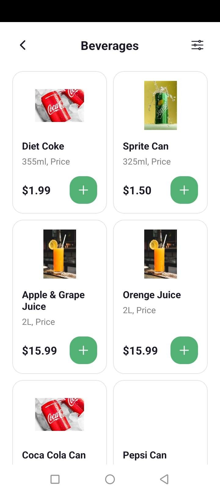
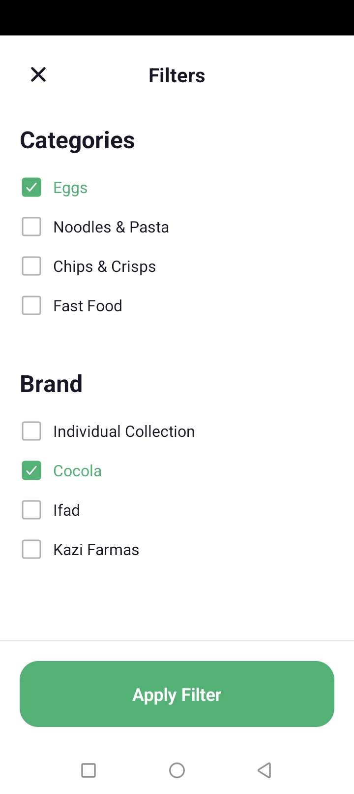
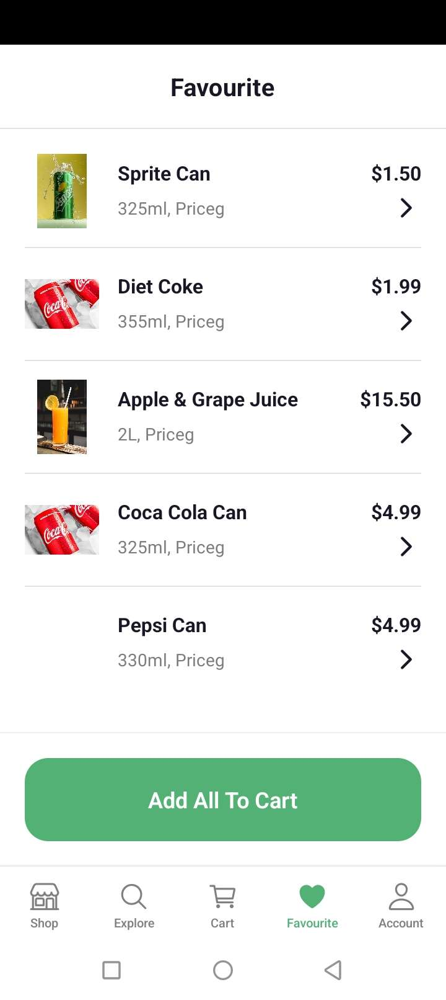
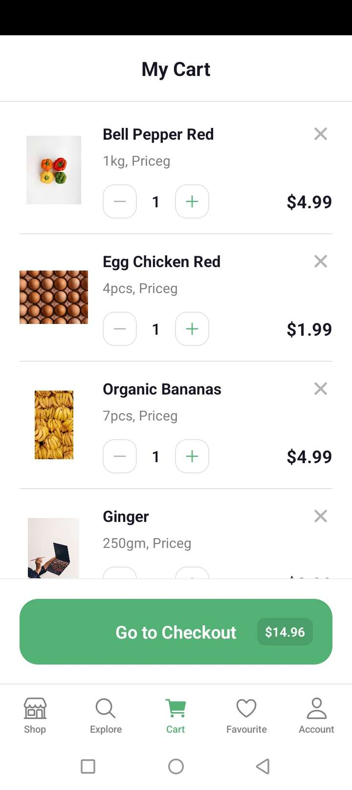

## **Họ tên : Phạm Quang Linh**
## **MSSV : 23810310260**
## **Lớp: D18CNMP4**

## Demo Video:

## Demo Images:

   

---

## Câu hỏi ôn tập về AsyncStorage & State Management

### 1. AsyncStorage hoạt động như thế nào?
*   **Cơ chế**: `AsyncStorage` là một hệ thống lưu trữ dữ liệu dạng **Key-Value**, bất đồng bộ (asynchronous) và duy nhất (unencrypted) dành cho React Native.
*   **Lưu trữ**: Dữ liệu được lưu trữ dưới dạng **String** ở bộ nhớ trong của thiết bị (SQLite trên Android và file hệ thống trên iOS).
*   **Hoạt động**: Vì là hệ thống bất đồng bộ, mọi thao tác (setItem, getItem) đều trả về một `Promise`. Khi lưu Object hoặc Array, cần dùng `JSON.stringify()` và khi lấy ra cần dùng `JSON.parse()`.

### 2. Vì sao dùng AsyncStorage thay vì biến state?
*   **Tính bền vững (Persistence)**: Biến `state` chỉ tồn tại trong bộ nhớ tạm (RAM). Khi người dùng tắt hẳn ứng dụng hoặc khởi động lại điện thoại, `state` sẽ bị xóa sạch.
*   **Lưu trữ dài hạn**: `AsyncStorage` lưu dữ liệu vào bộ nhớ vật lý của thiết bị. Dữ liệu sẽ vẫn tồn tại ngay cả khi app bị đóng, giúp triển khai các tính năng như: Lưu giỏ hàng, ghi nhớ đăng nhập (Auto-login), hoặc cài đặt người dùng (Theme, Ngôn ngữ).

### 3. So sánh AsyncStorage với Context API

| Tiêu chí | AsyncStorage | Context API |
| :--- | :--- | :--- |
| **Mục đích** | Lưu trữ dữ liệu lâu dài trên thiết bị. | Chia sẻ và đồng bộ dữ liệu giữa các component. |
| **Vị trí lưu** | Bộ nhớ trong (Disk). | Bộ nhớ tạm (RAM). |
| **Thời gian tồn tại** | Vĩnh viễn (đến khi bị xóa). | Mất khi ứng dụng bị đóng hoàn toàn. |
| **Tốc độ** | Chậm hơn (do thao tác đọc/ghi file). | Rất nhanh (truy cập trực tiếp bộ nhớ). |
| **Kiểu dữ liệu** | Chỉ lưu String (cần JSON serialize). | Lưu được mọi kiểu (Object, Function, Number...). |

**Kết luận**: Trong thực tế, chúng ta thường kết hợp cả hai: Dùng `AsyncStorage` để lưu dữ liệu xuống máy, và dùng `Context API` để quản lý và cập nhật dữ liệu đó lên giao diện một cách nhanh chóng khi app đang chạy.
